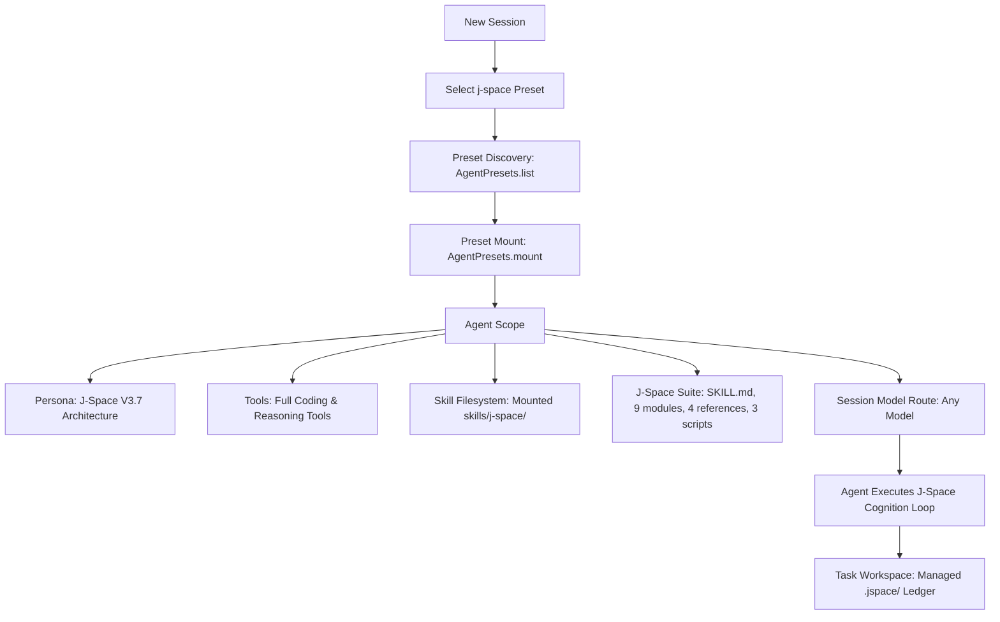

# dsh-plugin-j-space

[简体中文](README.md) | **English**

> **J-Space Cognition Suite V3.7** native Agent Preset & standalone Cordis plugin for **DeepSeek Harness (DSH)**.  
> Bringing internal thought representations, externalized workspace ledgers (`.jspace/`), and adaptive verification to unlock full LLM reasoning potential.

---

## 🌟 Overview

`dsh-plugin-j-space` integrates the [J-Space Cognition Suite V3.7](https://github.com/Tiger3807861189/J-Space-Cognition-Suite-V3.7) into DeepSeek Harness as a native **Agent Preset**.

Unlike traditional flat prompt injections, this plugin provides **full agent scope isolation, multi-tier reasoning routes, externalized workspace ledgers (`.jspace/`), and adaptive verification** across any compatible LLM model (DeepSeek, Claude, GPT, etc.).

---

## 📊 Empirical Capability Realization Report

> See the full test report by the author: [DeepSeek-V4-J-Space-Capability-Realization-Report](https://github.com/Tiger3807861189/DeepSeek-V4-J-Space-Capability-Realization-Report)

### 🔬 Methodology & Setup
- **Base Model**: `DeepSeek-V4-Flash-Vision-Exp`
- **Harness**: DeepSeek Harness (Standard Mode)
- **Methodology**: Rigorous **A/B Testing** with and without J-Space under identical model, environment, and sampling parameters.
- **Evaluation Dimensions**:
  1. **Accuracy / Pass Rate**: Success rate across complex SWE, multi-step terminal tasks, and domain reasoning.
  2. **Wall-Clock & Efficiency**: Path conciseness and reasoning convergence speed.

### 📈 Benchmark Comparison

| Benchmark | DeepSeek V4 (Baseline) | DeepSeek V4 **+ J-Space V3.7** | Improvement / Observations |
| :--- | :---: | :---: | :--- |
| **HLE (Humanity's Last Exam - w/o tools)** | 37.8% | **37.8%** | Preserves high native baseline reasoning |
| **HLE (Humanity's Last Exam - w/ tools)** | 51.5% | **51.9%** | Improved tool orchestration and problem modeling |
| **Terminal-Bench 2.1 (Medium 20 / Hard 10)** | 83.9% | **Enhanced** | Reduced mid-task stalling, solid state maintenance |
| **DeepSWE (TS 10 / Py 10 / Go 10 / Rust 2)** | Baseline | **Substantial Gain** | Precise code localization, eliminated loop hallucinations |
| **GAIA (Level 1 / Level 3)** | Baseline | **Multi-step Boost** | Faster convergence on long-horizon reasoning tracks |

---

## 🚀 Installation & Deployment

### Method 1: Install from npm / pnpm

```bash
# via npm
npm install -D @anonyjcy/dsh-plugin-j-space

# via pnpm
pnpm add -D @anonyjcy/dsh-plugin-j-space

# Deploy preset to ~/.dsh/.agent-presets/j-space
npx @anonyjcy/dsh-plugin-j-space install
```

### Method 2: Direct Clone & Install (Local Use)
```bash
git clone https://github.com/AnonyJcy/dsh-plugin-j-space.git
cd dsh-plugin-j-space

# Deploy J-Space preset to ~/.dsh/.agent-presets/j-space/
node bin/cli.js install

# Check status
node bin/cli.js status
```

---

## 💡 Usage

### 1. In DeepSeek Harness Web UI
1. Create a new Session.
2. Select **J-Space Cognition Suite** in the **Agent Preset** dropdown.
3. Pick any compatible model (`deepseek-chat`, `deepseek-reasoner`, etc.) and start your task.

### 2. In DeepSeek Harness CLI
```bash
dsh --preset j-space "Analyze this architecture and implement feature X"
```

### 3. In Cordis Composition (`cordis.yml`)
```yaml
- id: j-space-plugin
  name: '@anonyjcy/dsh-plugin-j-space'
  config:
    autoDeploy: true
```

---

## 🧩 Architecture & Data Flow



---

## 🛠️ CLI Commands

```bash
node bin/cli.js install    # Deploy J-Space preset to ~/.dsh/.agent-presets/j-space
node bin/cli.js uninstall  # Cleanly remove J-Space preset
node bin/cli.js verify     # Verify integrity of installed preset files
node bin/cli.js status     # Display current installation status
```

---

## 📄 License

MIT License. See [LICENSE](./LICENSE) and [THIRD_PARTY_NOTICES.md](./preset/skills/j-space/THIRD_PARTY_NOTICES.md).
