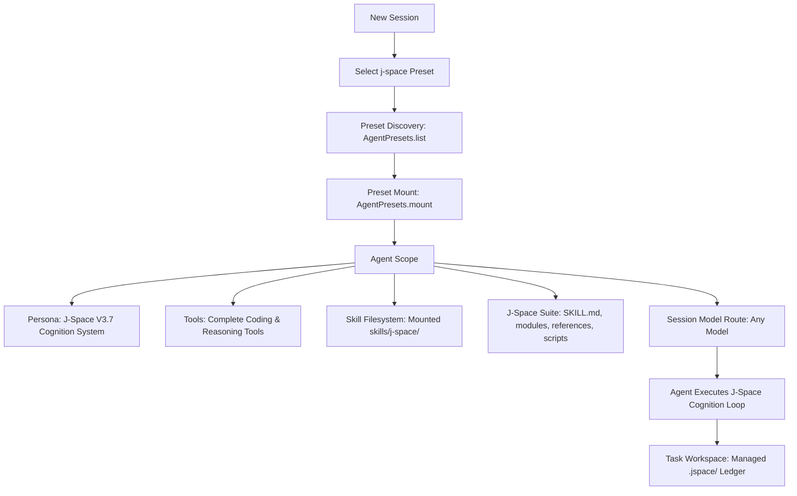

# dsh-plugin-j-space

English | [简体中文](#简体中文)

> **J-Space Cognition Suite V3.7** native Agent Preset & standalone Cordis plugin for **DeepSeek Harness (DSH)**.

---

## 🌟 Overview

`dsh-plugin-j-space` integrates the [J-Space Cognition Suite V3.7](https://github.com/Tiger3807861189/J-Space-Cognition-Suite-V3.7) into DeepSeek Harness as a native **Agent Preset**.

Unlike traditional flat prompt injections, this plugin provides **full agent scope isolation, multi-tier reasoning routes, externalized workspace ledgers (`.jspace/`), and adaptive verification** across any compatible LLM model (DeepSeek, Claude, GPT, etc.).

---

## 🚀 Quick Start

### Installation

Install into your DeepSeek Harness environment:

```bash
# via npm
npm install -D @deepseek-ai/dsh-plugin-j-space

# via pnpm
pnpm add -D @deepseek-ai/dsh-plugin-j-space
```

### Deploying the Preset

Run the CLI command to deploy the preset into your user preset directory (`~/.deepseek-harness/.agent-presets/j-space/`):

```bash
npx dsh-j-space install
```

Verify installation status:

```bash
npx dsh-j-space status
```

---

## 💡 Usage

### In DeepSeek Harness Web UI
1. Create a new Session.
2. In the **Agent Preset** dropdown, select **J-Space Cognition Suite**.
3. Pick any compatible model (`deepseek-chat`, `deepseek-reasoner`, etc.).
4. Start your task.

### In DeepSeek Harness CLI
```bash
dsh --preset j-space "Analyze this codebase and optimize the performance"
```

### In Cordis Composition (`cordis.yml`)
```yaml
- id: j-space-plugin
  name: '@deepseek-ai/dsh-plugin-j-space'
  config:
    autoDeploy: true
```

---

## 🧩 Architecture & Data Flow



### J-Space Cognition Architecture
- **Premise & Awakening**: 60-second orientation, fast/full/loop routing gates.
- **9 Core Modules**: `capacity`, `broadcast`, `deep-reasoning`, `directed-focus`, `empirics`, `introspection`, `markers`, `self-monitoring`, `shorthand`.
- **4 Reference Frameworks**: `exemplars`, `induction-playbook`, `j-space-science`, `problem-model`.
- **Active Ledger (`jspace.py`)**: Localized `.jspace/WORKSPACE.md` and `history.json` for goal tracking, checkpoint assertions, seam auditing, and state resumption.

---

## 🛠️ CLI Commands

```bash
dsh-j-space install    # Deploy J-Space preset to ~/.deepseek-harness/.agent-presets/
dsh-j-space uninstall  # Remove J-Space preset cleanly
dsh-j-space verify     # Verify file integrity of the installed preset
dsh-j-space status     # Display current preset status
```

---

## 📄 License

MIT License. See [LICENSE](./LICENSE) and [THIRD_PARTY_NOTICES.md](./preset/skills/j-space/THIRD_PARTY_NOTICES.md) for details.

---

<a id="简体中文"></a>

# 简体中文

> **J-Space Cognition Suite V3.7** 深度思考与认知工作空间 —— DeepSeek Harness 原生 Agent Preset 独立插件。

---

## 🌟 项目简介

`dsh-plugin-j-space` 将 [J-Space Cognition Suite V3.7](https://github.com/Tiger3807861189/J-Space-Cognition-Suite-V3.7) 完整集成为 DeepSeek Harness 的一等公民 **Agent 预设 (Preset)**。

它不是粗暴的 Prompt 拼接，而是真正参与 Cordis **Agent Scope 生命周期隔离、多层认知路由、工作区状态外化账本（`.jspace/`）与自适应验证** 的完整体系，完全解耦并兼容任意大语言模型（DeepSeek-Chat、DeepSeek-Reasoner、Claude 等）。

---

## 🚀 快速开始

### 安装插件

```bash
# npm 安装
npm install -D @deepseek-ai/dsh-plugin-j-space

# pnpm 安装
pnpm add -D @deepseek-ai/dsh-plugin-j-space
```

### 一键部署预设

运行 CLI 工具将预设部署至当前机器的用户预设目录（`~/.deepseek-harness/.agent-presets/j-space/`）：

```bash
npx dsh-j-space install
```

查看安装状态与健康检查：

```bash
npx dsh-j-space status
```

---

## 💡 使用方法

### 1. Web UI 界面
1. 点击创建新会话（New Session）。
2. 在 Agent Preset 下拉选单中选择 **J-Space Cognition Suite**。
3. 选择任意模型并开始任务。

### 2. CLI 命令行
```bash
dsh --preset j-space "全面重构此模块并补充单元测试"
```

### 3. Cordis 配置文件组装 (`cordis.yml`)
```yaml
- id: j-space-plugin
  name: '@deepseek-ai/dsh-plugin-j-space'
  config:
    autoDeploy: true
```

---

## 🛠️ CLI 常用指令

```bash
dsh-j-space install    # 安装 J-Space Preset 到 DSH 用户预设目录
dsh-j-space uninstall  # 干净卸载 J-Space Preset
dsh-j-space verify     # 校验已安装预设的套件完整性
dsh-j-space status     # 查看当前安装状态与配置路径
```

---

## 📄 开源许可证

本项目基于 MIT 许可证开源。详见 [LICENSE](./LICENSE) 与 [THIRD_PARTY_NOTICES.md](./preset/skills/j-space/THIRD_PARTY_NOTICES.md)。
