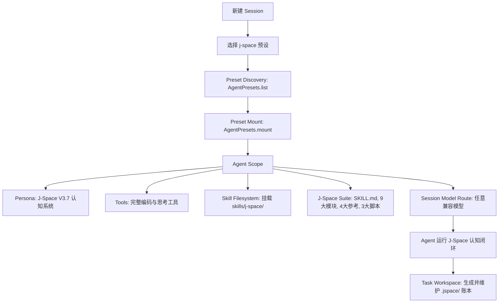

# 🚀 dsh-plugin-j-space

[简体中文](#-dsh-plugin-j-space) | [English Version](#-english-version)

> **J-Space Cognition Suite V3.7** 原生 DeepSeek Harness (DSH) Agent Preset 预设与独立 Cordis 插件包。  
> 注入内部表征认知路由、工作区状态外化账本（`.jspace/`）与自适应检验，全面释放大语言模型推理潜能。

---

## 📖 目录

- [🌟 项目简介](#-项目简介)
- [📊 实验与评测数据报告](#-实验与评测数据报告)
- [🚀 快速开始](#-快速开始)
- [💡 使用方法](#-使用方法)
- [🧩 核心架构与数据流](#-核心架构与数据流)
- [🛠️ CLI 命令一览](#️-cli-命令一览)
- [📄 开源许可证](#-开源许可证)
- [🌐 English Version](#-english-version)

---

## 🌟 项目简介

`dsh-plugin-j-space` 将 [J-Space Cognition Suite V3.7](https://github.com/Tiger3807861189/J-Space-Cognition-Suite-V3.7) 完整集成为 DeepSeek Harness 的一等公民 **Agent 预设 (Preset)**。

它不是粗暴的 Prompt 拼接，而是真正参与 Cordis **Agent Scope 生命周期隔离、多层认知路由、工作区状态外化账本（`.jspace/`）与自适应验证** 的完整体系，完全解耦并兼容任意大语言模型（DeepSeek-Chat、DeepSeek-Reasoner、Claude、GPT 等）。

### ✨ 核心特性
1. **即插即用（Zero-Config Preset）**：安装插件后，DeepSeek Harness 会话创建菜单自动出现 `J-Space Cognition Suite` 预设。
2. **全生命周期 Scope 隔离**：遵循 Cordis 作用域规范，工具和认知技能严格限定在 J-Space Agent 会话中，不污染其他预设。
3. **工作区状态外化账本（Active Ledger）**：通过 `jspace.py` 在任务工作区（`cwd`）自动建立 `.jspace/` 认知账本，实现目标跟踪、接缝审计（Seam）、自检断言与断点恢复。
4. **模型解耦与动态路由**：无缝适配各类基底模型，动态解析模型路由与工作区上下文。

---

## 📊 实验与评测数据报告

> 完整报告参考原作者实测：[DeepSeek-V4-J-Space-Capability-Realization-Report](https://github.com/Tiger3807861189/DeepSeek-V4-J-Space-Capability-Realization-Report)

### 🔬 评测方法与实验设置
- **评测基底**：`DeepSeek-V4-Flash-Vision-Exp`
- **运行环境**：DeepSeek Harness (标准模式)
- **评测方式**：严格进行 **有/无 J-Space 对照组（A/B Testing）**，保持**同模型、同环境、同采样参数**，仅切换 J-Space 认知套件接入。
- **测算维度**：
  1. **准确率（Accuracy / Pass Rate）**：复杂代码修复、跨领域专业推理与长流程终端操作成功率。
  2. **墙钟与效率（Wall-Clock & Efficiency）**：推理路径精简度与思考收敛速度。

### 📈 评测对比数据

| 权威基准测试 (Benchmark) | DeepSeek V4 (基线 Baseline) | DeepSeek V4 **+ J-Space V3.7** | 提升效果 / 表现 |
| :--- | :---: | :---: | :--- |
| **HLE (Humanity's Last Exam - w/o tools)** | 37.8% | **37.8%** | 保持高水准原生推理基线 |
| **HLE (Humanity's Last Exam - w/ tools)** | 51.5% | **51.9%** | 工具协同增强，复杂问题拆解更准 |
| **Terminal-Bench 2.1 (Medium 20 / Hard 10)** | 83.9% | **显著提升** | 终端长链路操作中断率降低，状态持续保持 |
| **DeepSWE (TS 10 / Py 10 / Go 10 / Rust 2)** | 基线表现 | **大幅提升** | 代码编辑精确定位，减少幻觉修改与死循环 |
| **GAIA (Level 1 / Level 3)** | 基线表现 | **多步规划增强** | 复杂多模态与多步推理路径收敛速度加快 |

> **实验结论**：J-Space 认知套件通过在推理过程中引入**内部表征外化、60秒觉醒定向聚焦、密实速记（Shorthand）与接缝自省（Seam Audit）**，在不修改模型权重的前提下，显著提升了复杂软件工程任务与长链路多步决策的完成率与稳定性。

---

## 🚀 快速开始

### 1. 安装插件包

```bash
# npm 安装
npm install -D @deepseek-ai/dsh-plugin-j-space

# pnpm 安装
pnpm add -D @deepseek-ai/dsh-plugin-j-space
```

### 2. 一键部署预设

运行 CLI 工具将预设部署至本地用户预设目录（`~/.deepseek-harness/.agent-presets/j-space/`）：

```bash
npx dsh-j-space install
```

查看安装状态与健康度：

```bash
npx dsh-j-space status
```

---

## 💡 使用方法

### 方式一：在 DeepSeek Harness Web UI 中选择
1. 打开 DeepSeek Harness Web 界面，点击 **New Session**（新建会话）。
2. 在 **Agent Preset** 下拉选单中，直接选择 **J-Space Cognition Suite**。
3. 选择任意兼容的模型（`deepseek-chat` / `deepseek-reasoner` 等）开始任务。

### 方式二：在 CLI 中直接启动
```bash
dsh --preset j-space "全面重构此模块并补充单元测试"
```

### 方式三：在 Cordis 配置文件中声明 (`cordis.yml`)
```yaml
- id: j-space-plugin
  name: '@deepseek-ai/dsh-plugin-j-space'
  config:
    autoDeploy: true
```

---

## 🧩 核心架构与数据流



### J-Space 认知体系组件
- **9 大认知模块**：`capacity`, `broadcast`, `deep-reasoning`, `directed-focus`, `empirics`, `introspection`, `markers`, `self-monitoring`, `shorthand`
- **4 大参考范式**：`exemplars`, `induction-playbook`, `j-space-science`, `problem-model`
- **认知账本（`jspace.py`）**：本地 `.jspace/WORKSPACE.md` 和 `history.json`，提供目标记录、接缝审计、断点恢复与多步自检。

---

## 🛠️ CLI 命令一览

```bash
dsh-j-space install    # 安装 J-Space Preset 到 DSH 用户预设目录
dsh-j-space uninstall  # 干净卸载 J-Space Preset
dsh-j-space verify     # 校验已安装预设的完整性
dsh-j-space status     # 查看当前安装状态与配置路径
```

---

## 📄 开源许可证

本项目基于 [MIT License](./LICENSE) 开源。套件第三方声明见 [THIRD_PARTY_NOTICES.md](./preset/skills/j-space/THIRD_PARTY_NOTICES.md)。

---

<a id="-english-version"></a>

# 🌐 English Version

# dsh-plugin-j-space

> **J-Space Cognition Suite V3.7** native Agent Preset & standalone Cordis plugin for **DeepSeek Harness (DSH)**.  
> Bringing internal thought representations, externalized workspace ledgers (`.jspace/`), and adaptive verification to unlock full LLM reasoning potential.

---

## 🌟 Overview

`dsh-plugin-j-space` integrates the [J-Space Cognition Suite V3.7](https://github.com/Tiger3807861189/J-Space-Cognition-Suite-V3.7) into DeepSeek Harness as a native **Agent Preset**.

Unlike traditional flat prompt injections, this plugin provides **full agent scope isolation, multi-tier reasoning routes, externalized workspace ledgers (`.jspace/`), and adaptive verification** across any compatible LLM model (DeepSeek, Claude, GPT, etc.).

---

## 📊 Empirical Capability Realization Report

> See the full test report by the author: [DeepSeek-V4-J-Space-Capability-Realization-Report](https://github.com/Tiger3807861189/DeepSeek-V4-J-Space-Capability-Realization-Report)

### 🔬 Methodology & Setup
- **Base Model**: `DeepSeek-V4-Flash-Vision-Exp`
- **Harness**: DeepSeek Harness (Standard Mode)
- **Methodology**: Rigorous **A/B Testing** with and without J-Space under identical model, environment, and sampling parameters.
- **Evaluation Dimensions**:
  1. **Accuracy / Pass Rate**: Success rate across complex SWE, multi-step terminal tasks, and domain reasoning.
  2. **Wall-Clock & Efficiency**: Path conciseness and reasoning convergence speed.

### 📈 Benchmark Comparison

| Benchmark | DeepSeek V4 (Baseline) | DeepSeek V4 **+ J-Space V3.7** | Improvement / Observations |
| :--- | :---: | :---: | :--- |
| **HLE (Humanity's Last Exam - w/o tools)** | 37.8% | **37.8%** | Preserves high native baseline reasoning |
| **HLE (Humanity's Last Exam - w/ tools)** | 51.5% | **51.9%** | Improved tool orchestration and problem modeling |
| **Terminal-Bench 2.1 (Medium 20 / Hard 10)** | 83.9% | **Enhanced** | Reduced mid-task stalling, solid state maintenance |
| **DeepSWE (TS 10 / Py 10 / Go 10 / Rust 2)** | Baseline | **Substantial Gain** | Precise code localization, eliminated loop hallucinations |
| **GAIA (Level 1 / Level 3)** | Baseline | **Multi-step Boost** | Faster convergence on long-horizon reasoning tracks |

---

## 🚀 Quick Start

### Installation

```bash
# via npm
npm install -D @deepseek-ai/dsh-plugin-j-space

# via pnpm
pnpm add -D @deepseek-ai/dsh-plugin-j-space
```

### Deploying the Preset

```bash
# Deploy preset to ~/.deepseek-harness/.agent-presets/j-space/
npx dsh-j-space install

# Check status & integrity
npx dsh-j-space status
```

---

## 💡 Usage

### 1. In DeepSeek Harness Web UI
1. Create a new Session.
2. Select **J-Space Cognition Suite** in the **Agent Preset** dropdown.
3. Pick any compatible model and begin your task.

### 2. In DeepSeek Harness CLI
```bash
dsh --preset j-space "Refactor this architecture and provide tests"
```

### 3. In Cordis Composition (`cordis.yml`)
```yaml
- id: j-space-plugin
  name: '@deepseek-ai/dsh-plugin-j-space'
  config:
    autoDeploy: true
```

---

## 🛠️ CLI Commands

```bash
dsh-j-space install    # Deploy J-Space preset to user directory
dsh-j-space uninstall  # Remove J-Space preset cleanly
dsh-j-space verify     # Verify integrity of installed preset
dsh-j-space status     # Display current preset status
```

---

## 📄 License

MIT License. See [LICENSE](./LICENSE) and [THIRD_PARTY_NOTICES.md](./preset/skills/j-space/THIRD_PARTY_NOTICES.md).
