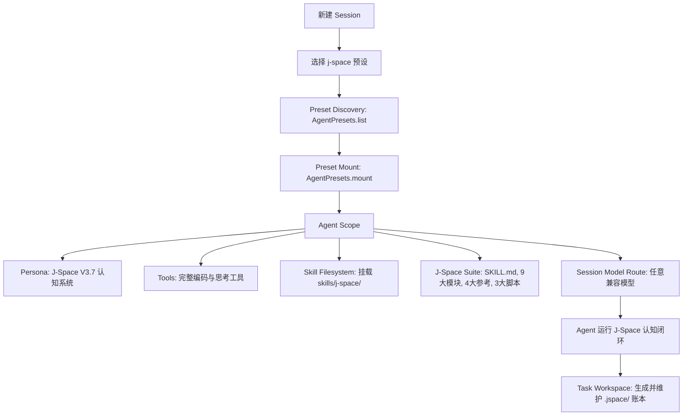

# 🚀 dsh-plugin-j-space

**简体中文** | [English Version](README.en.md)

> **J-Space Cognition Suite V3.7** 原生 DeepSeek Harness (DSH) Agent Preset 预设与独立 Cordis 插件包。  
> 注入内部表征认知路由、工作区状态外化账本（`.jspace/`）与自适应检验，全面释放大语言模型推理潜能。

---

## 🌟 项目简介

`dsh-plugin-j-space` 将 [J-Space Cognition Suite V3.7](https://github.com/Tiger3807861189/J-Space-Cognition-Suite-V3.7) 完整集成为 DeepSeek Harness 的一等公民 **Agent 预设 (Preset)**。

它不是粗暴的 Prompt 拼接，而是真正参与 Cordis **Agent Scope 生命周期隔离、多层认知路由、工作区状态外化账本（`.jspace/`）与自适应验证** 的完整体系，完全解耦并兼容任意大语言模型（DeepSeek-Chat、DeepSeek-Reasoner、Claude、GPT 等）。

### ✨ 核心特性
1. **即插即用（Zero-Config Preset）**：部署预设后，DeepSeek Harness 会话创建菜单自动出现 `J-Space Cognition Suite` 预设。
2. **全生命周期 Scope 隔离**：遵循 Cordis 作用域规范，工具和认知技能严格限定在 J-Space Agent 会话中，不污染其他预设。
3. **工作区状态外化账本（Active Ledger）**：通过 `jspace.py` 在任务工作区（`cwd`）自动建立 `.jspace/` 认知账本，实现目标跟踪、接缝审计（Seam）、自检断言与断点恢复。
4. **模型解耦与动态路由**：无缝适配各类基底模型，动态解析模型路由与工作区上下文。

---

## 📊 实验与评测数据报告

> 完整报告参考原作者实测：[DeepSeek-V4-J-Space-Capability-Realization-Report](https://github.com/Tiger3807861189/DeepSeek-V4-J-Space-Capability-Realization-Report)

### 🔬 评测方法与实验设置
- **评测基底**：`DeepSeek-V4-Flash-Vision-Exp`
- **运行环境**：DeepSeek Harness (标准模式)
- **评测方式**：严格进行 **有/无 J-Space 对照组（A/B Testing）**，保持**同模型、同环境、同采样参数**，仅切换 J-Space 认知套件接入。
- **测算维度**：
  1. **准确率（Accuracy / Pass Rate）**：复杂代码修复、跨领域专业推理与长流程终端操作成功率。
  2. **墙钟与效率（Wall-Clock & Efficiency）**：推理路径精简度与思考收敛速度。

### 📈 评测对比数据

| 权威基准测试 (Benchmark) | DeepSeek V4 (基线 Baseline) | DeepSeek V4 **+ J-Space V3.7** | 提升效果 / 表现 |
| :--- | :---: | :---: | :--- |
| **HLE (Humanity's Last Exam - w/o tools)** | 37.8% | **37.8%** | 保持高水准原生推理基线 |
| **HLE (Humanity's Last Exam - w/ tools)** | 51.5% | **51.9%** | 工具协同增强，复杂问题拆解更准 |
| **Terminal-Bench 2.1 (Medium 20 / Hard 10)** | 83.9% | **显著提升** | 终端长链路操作中断率降低，状态持续保持 |
| **DeepSWE (TS 10 / Py 10 / Go 10 / Rust 2)** | 基线表现 | **大幅提升** | 代码编辑精确定位，减少幻觉修改与死循环 |
| **GAIA (Level 1 / Level 3)** | 基线表现 | **多步规划增强** | 复杂多模态与多步推理路径收敛速度加快 |

> **实验结论**：J-Space 认知套件通过在推理过程中引入**内部表征外化、60秒觉醒定向聚焦、密实速记（Shorthand）与接缝自省（Seam Audit）**，在不修改模型权重的前提下，显著提升了复杂软件工程任务与长链路多步决策的完成率与稳定性。

---

## 🚀 安装与一键部署

本插件内置了开箱即用的原生 Node.js CLI 工具，无需额外安装其他依赖即可直接执行安装：

### 方式一：克隆仓库直接安装（推荐本地使用）

```bash
git clone https://github.com/AnonyJcy/dsh-plugin-j-space.git
cd dsh-plugin-j-space

# 一键部署预设到 ~/.dsh/.agent-presets/j-space
node bin/cli.js install

# 检查安装状态与完整性
node bin/cli.js status
```

### 方式二：通过 Git / npm 安装到你的 DSH 项目

```bash
# 在 DeepSeek Harness 项目根目录中添加依赖
pnpm add -D github:AnonyJcy/dsh-plugin-j-space

# 运行 CLI 部署
npx dsh-j-space install
```

---

## 💡 使用方法

### 1. Web UI 界面
1. 打开 DeepSeek Harness Web 界面，点击 **New Session**（新建会话）。
2. 在 **Agent Preset** 下拉选单中，直接选择 **J-Space Cognition Suite**。
3. 选择任意兼容的模型（`deepseek-chat` / `deepseek-reasoner` 等）开始任务。

### 2. CLI 命令行
```bash
dsh --preset j-space "全面重构此模块并补充单元测试"
```

### 3. Cordis 配置文件组装 (`cordis.yml`)
```yaml
- id: j-space-plugin
  name: '@deepseek-ai/dsh-plugin-j-space'
  config:
    autoDeploy: true
```

---

## 🧩 核心架构与数据流



---

## 🛠️ CLI 命令一览

```bash
node bin/cli.js install    # 安装 J-Space Preset 到 DSH 用户预设目录 (~/.dsh/.agent-presets/j-space)
node bin/cli.js uninstall  # 干净卸载 J-Space Preset
node bin/cli.js verify     # 校验已安装预设的套件完整性
node bin/cli.js status     # 查看当前安装状态与配置路径
```

---

## 📄 开源许可证

本项目基于 [MIT License](./LICENSE) 开源。套件第三方声明见 [THIRD_PARTY_NOTICES.md](./preset/skills/j-space/THIRD_PARTY_NOTICES.md)。
